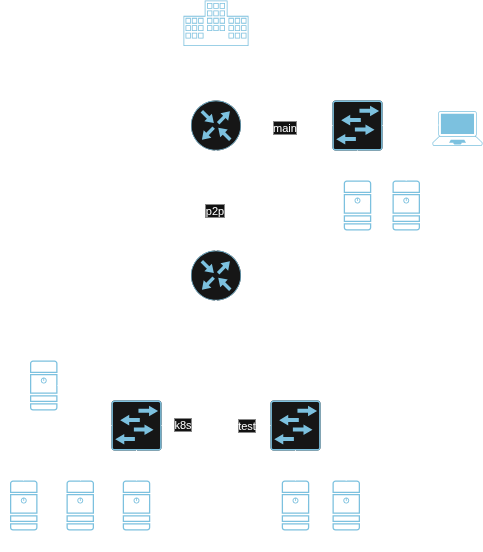
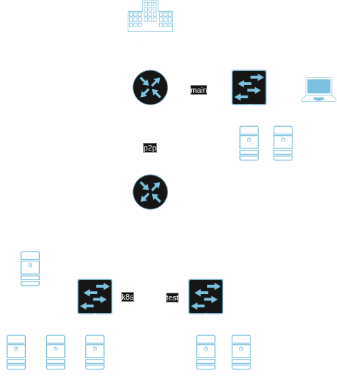
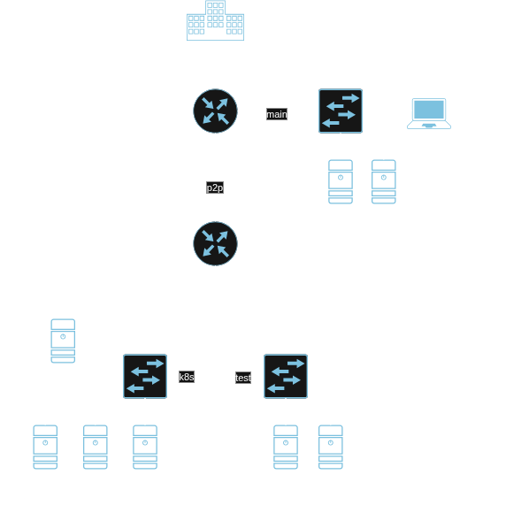
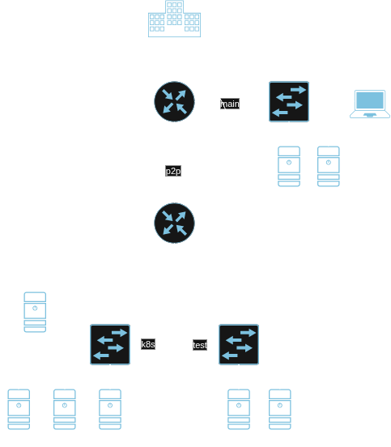

# Network
<h2>

Net plan

<h2>

L1 net plan

<h2>

L3 net plan

<h2>

OSPF net plan

## DNS
|address|FQDN|hostname|subnet|
|-------|----|--------|------|
|10.10.10.1|soks.local|soksPC|10.10.10.0/24|
|10.10.10.2|soks.local|mikrotik-control|10.10.10.0/24|
|192.168.77.2|soks.local|main|192.168.77.0/24|
|192.168.77.3|soks.local|main-replica|192.168.77.0/24|
|192.168.88.2|soks.local|mikrotik-worker|192.168.88.0/24|
|192.168.50.2|soks.local|k8s-control|192.168.50.0/24|
|192.168.50.3|soks.local|k8s-worker0|192.168.50.0/24|
|192.168.50.4|soks.local|k8s-worker1|192.168.50.0/24|
|192.168.50.5|soks.local|k8s-worker2|192.168.50.0/24|
|192.168.100.2|soks.local|test0|192.168.100.0/24|
|192.168.100.3|soks.local|test1|192.168.100.0/24|